# Lernjournal: Docker Deployment 

## Part 1: Build Image & Start Container 

- `https://github.com/zhaw-iwi/DevOpsNodeWebApp` forken per git clone im VSC öffnen 
- Docker Desktop starten für Build 
- Prüfen ob Jenkins läuft 
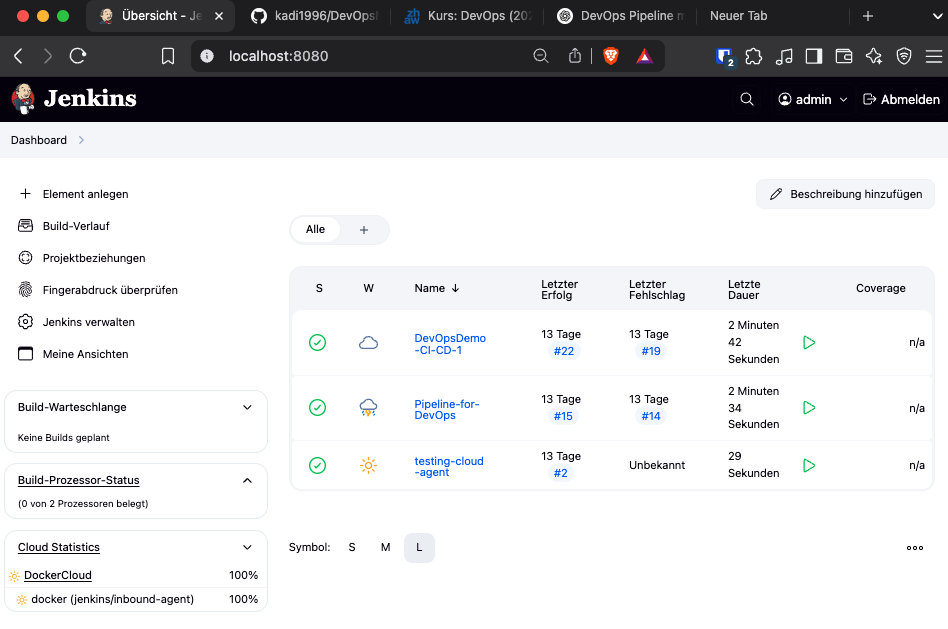

- Auf Jenkins ein Neues Element anlegen `"DevOpsNodeWebApp"`
- Ersten Build starten um zu prüfen
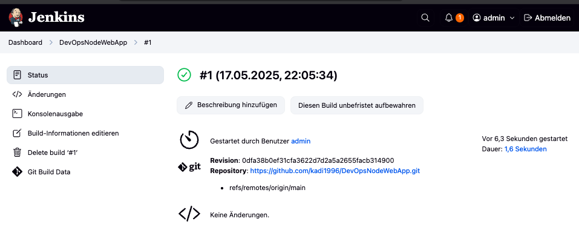

- Als nächstes möchte ich das Docker-Image bauen lassen
- Dafür gehe ich auf Dashboard -> Jenkins verwalten -> System 
- Leider finde ich Docker Build nicht 
- Ich installiere es aus den Plugins, starte socat und klicke auf Test Connection
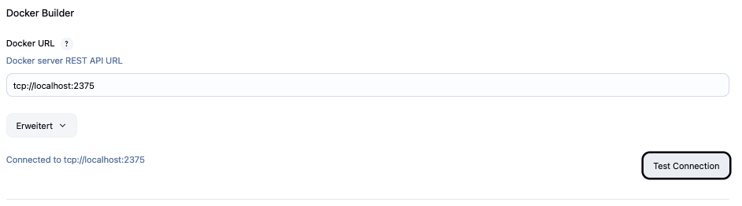

- Ich gehe ins Projekt und anschliessend -> Configure -> Build Steps -> Docker Command -> Create/build image 
- Build schlägt fehl, weil image nicht lowercase ist
- Dies ändere ich und führe es erneut aus -> build erfolgreich 
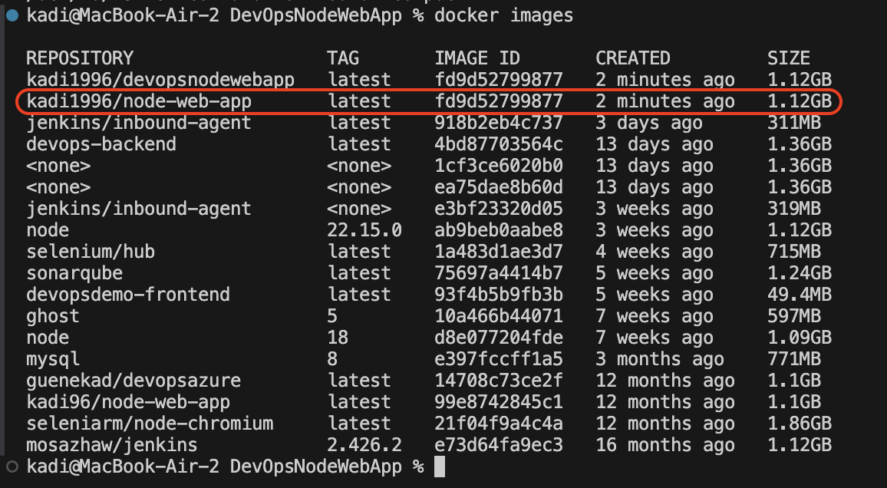

- Als nächstes möchte ich das image als Container starten 
- Neues Element anlegen -> `DevOpsNodeWebAppDeploy` als Freestyle Projekt -> Source-Code-Management -> Build Steps -> Docker Command -> Execute Docker Command -> Remove Container(s) 
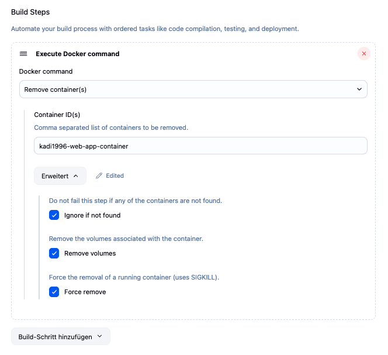

- Neues Build-Schritt hinzufügen -> Execute Docker Command -> Create Container -> Details eingeben 

- Neues Build-Schritt hinzufügen -> Execute Docker Command -> Start Container(s) -> Details eingeben

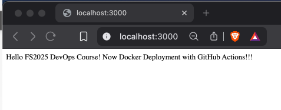

- Zwar findet er den container nicht, aber das ignoriert er aufgrund der Einstellung (ich glaube das ist so ok auch wenn es rot ist)
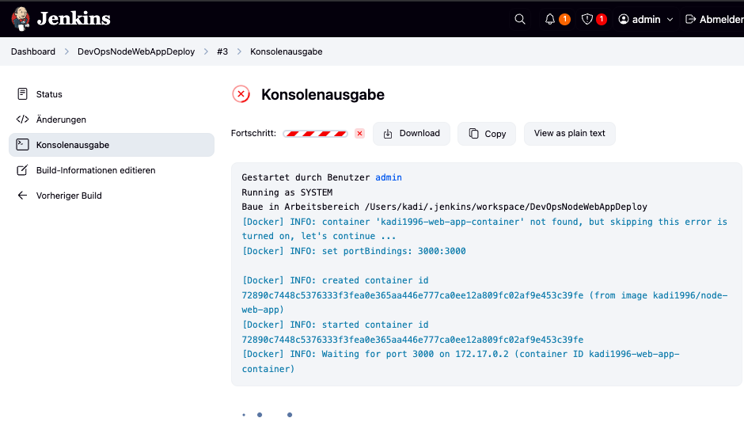

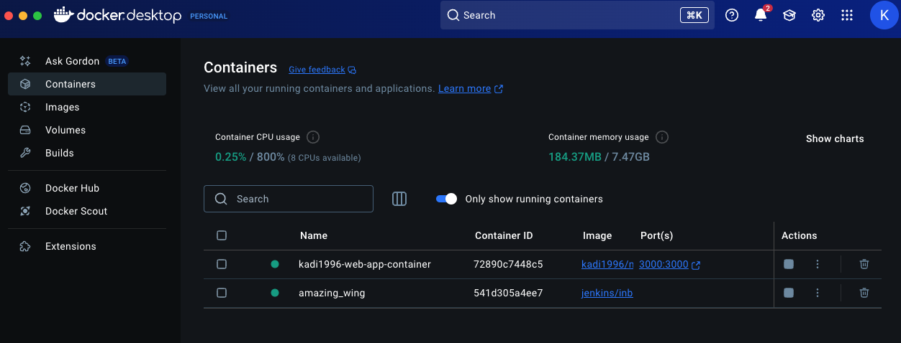

- Nächster Schritt ist den Trigger einzubauen: 

- Ich gehe in das "DevOpsNodeWebApp"-Projekt -> Konfigurieren -> Source Code Management System abfragen häkchen setzen -> Zeitplan eingeben -> in der server.js den Text anpassen 

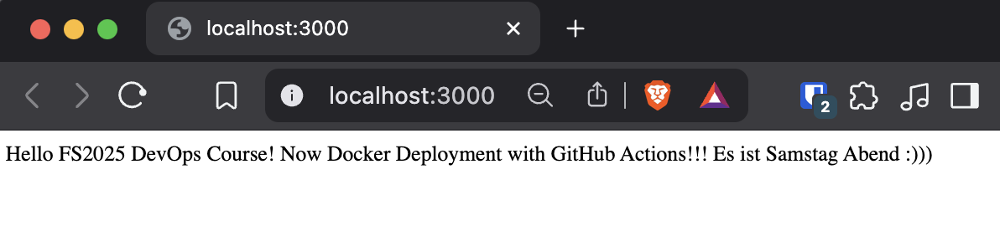

- Der Fehler / Error von oben hat sich ebenfalls behoben
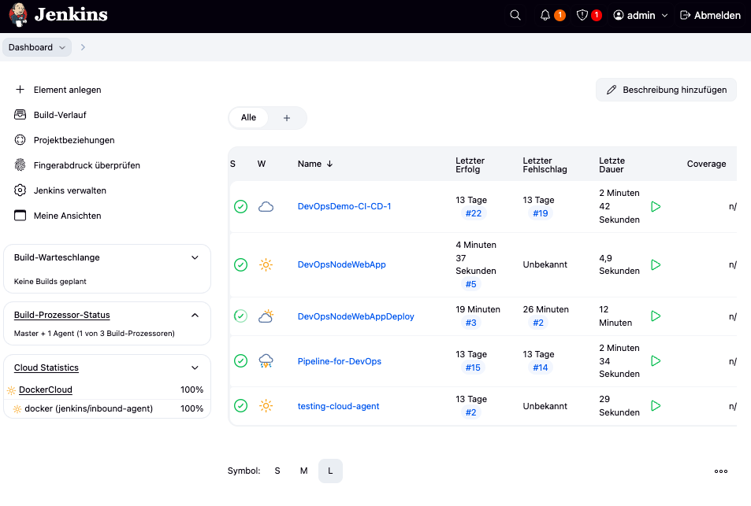

## Part 2: Deploy 
- Als nächstes möchte ich das erstellte Image auf Docker deployen
- Dafür gehe ich auf `hub.docker.com` -> Account Settings -> Personal Access Tokens -> Generate New Token -> 
- Danach gehe ich wieder auf Jenkins -> Verwalten -> Credentials -> System -> Add Credentials -> Token einfügen 
- Damit kann Docker auf Jenkins zugreifen 
- Danach gehe ich wieder ins VSC und greife auf die Jenkinsfile zu 
- Vorerst erstelle ich ein neues Element im Jenkins namens `DevOpsNodeWebAppRenderDeploy` und gebe folgendes ein: 
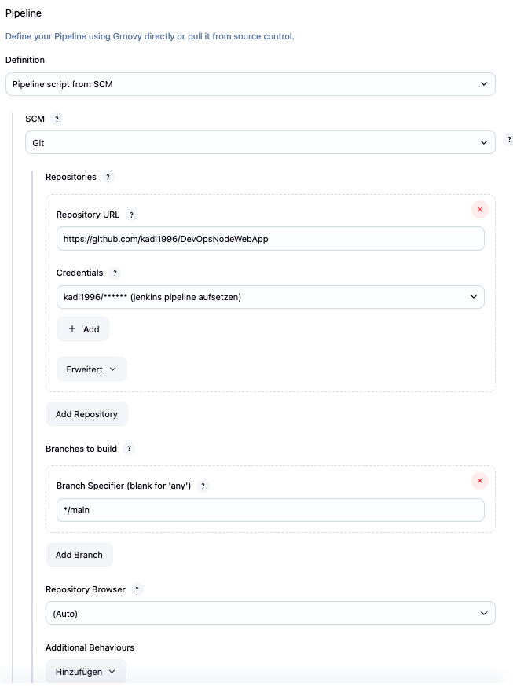

- Ich erstelle ein öffentliches repository auf meinem Docker Hub und pushe mein Ima

- Als nächstes gehe ich auf render.com -> Web Services -> Existing Image und suche nach `docker.io/kadi96/node-web-app:latest` -> Connect -> Deploy Services
(Hierfür habe ich ein Repository im Docker Hub erstellt und mein Image gepusht
)
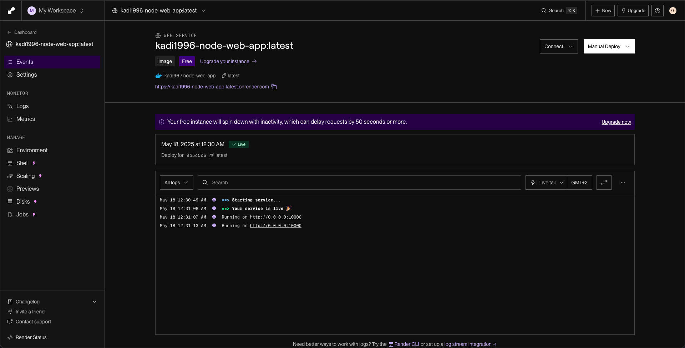

- Damit Render das Image akzeptiert, muss es explizit für linux/amd64 gebaut werden
- Dafür aktiviere ich Buildx im Terminal 
- In Jenkins nutze ich ein Jenkinsfile mit zwei Stages:
1. Docker Login & Push
2. Render Deployment Trigger per API-Hook

- Ich speichere meinen Render API Key in Jenkins unter Credentials -> Secret Text
- Danach aktualisiere ich mein Jenkinsfile, um den Key sicher zu nutzen
- Der Push schlägt zunächst fehl, weil ich versehentlich zu kadi1996 gepusht habe - statt kadi96
- Ich korrigiere den Namen im Jenkinsfile und push erneut -> Build erfolgreich 
- Render.com empfängt den Webhook von Jenkins automatisch und deployed die neue Version meiner App

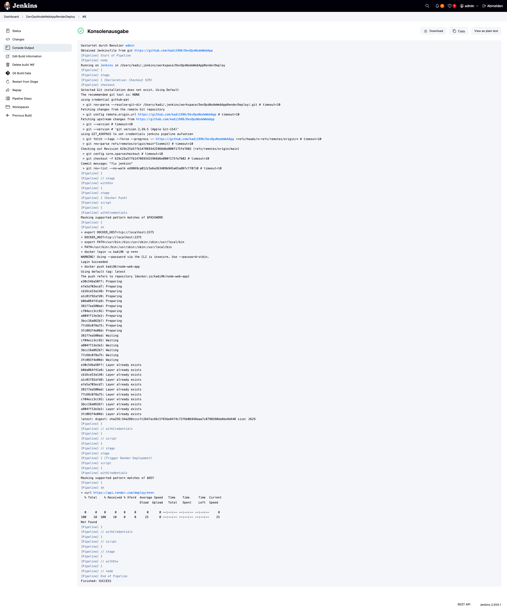

- Damit habe ich meines Erachtes alle Lernziele dieser Woche vollständig erfüllt und eine funktionierende CI/CD-Pipeline mit Jenkins, Docker und Render.com gebaut und automatisiert
